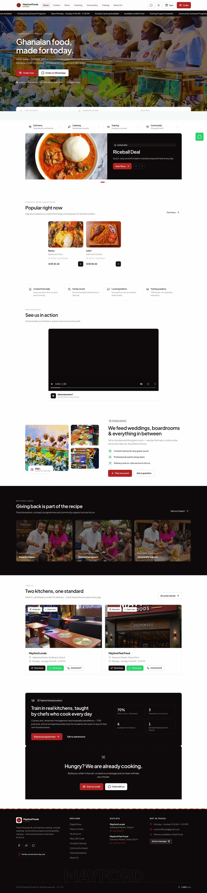
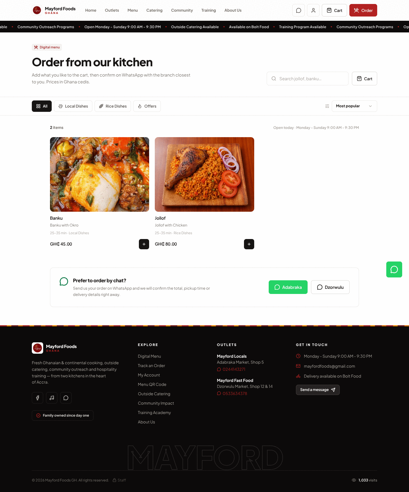
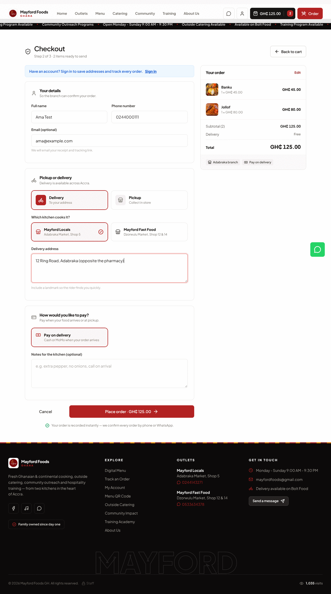
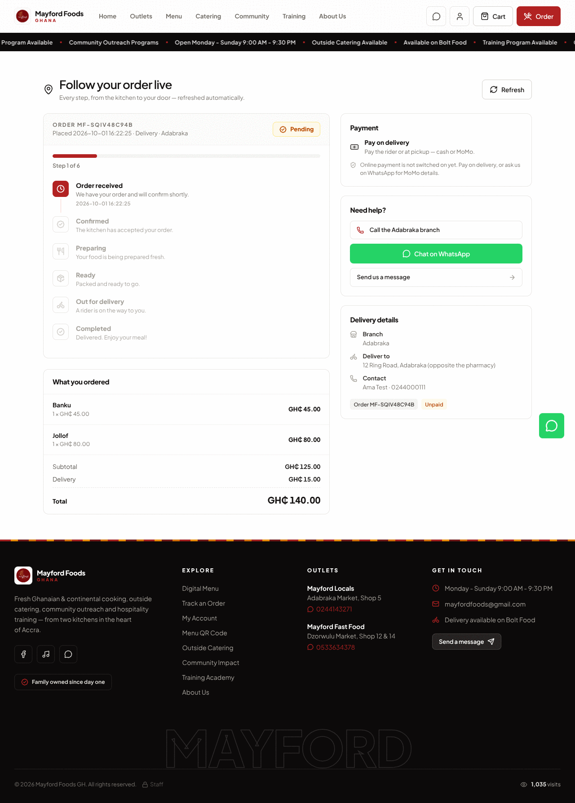
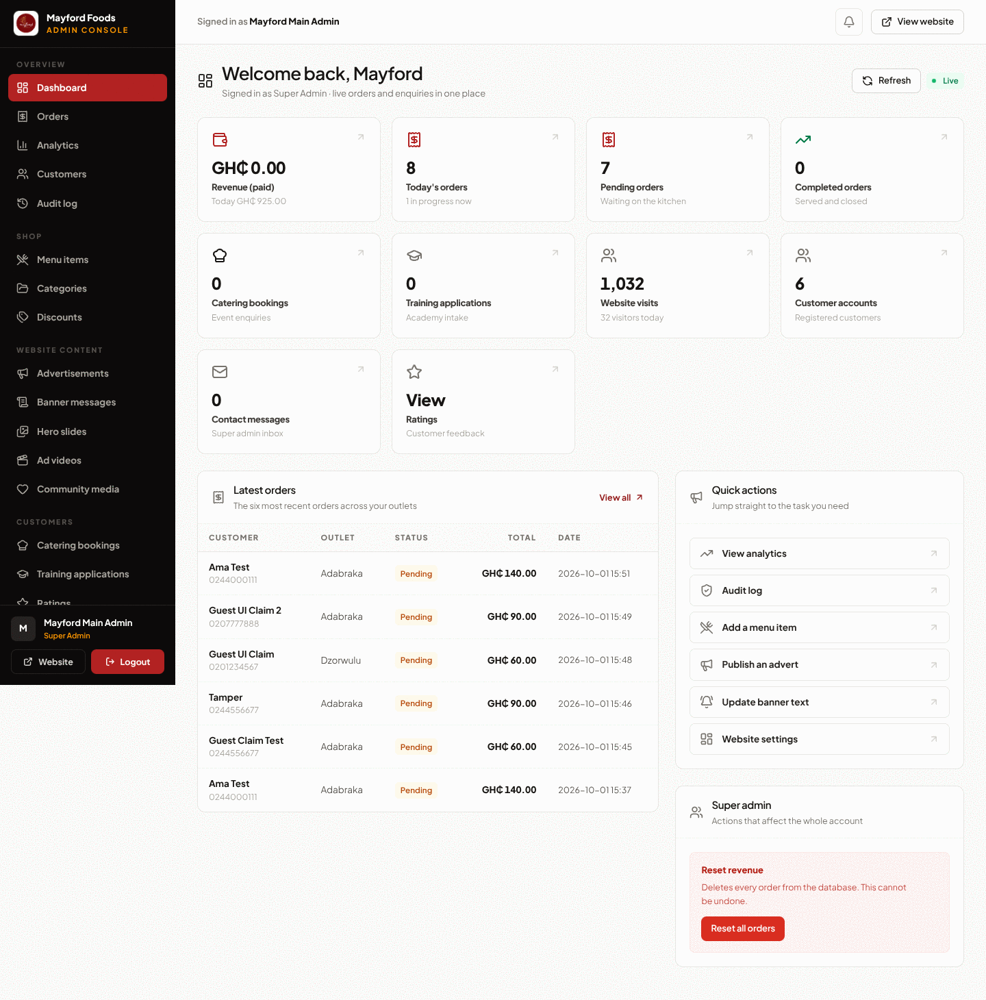
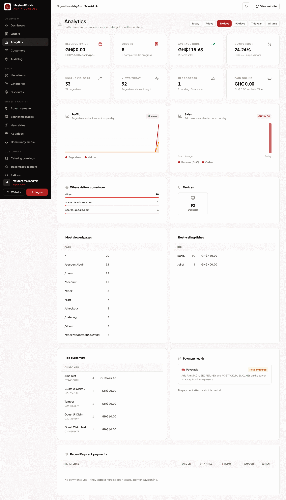

# Mayford Foods GH — React + TypeScript + Tailwind + MySQL

The old PHP/MySQL website has been migrated to a modern stack:

| Layer      | Technology                                             |
| ---------- | ------------------------------------------------------ |
| Frontend   | React 19 + TypeScript (Vite) + Tailwind CSS 4, React Router |
| Backend    | Node.js + Express + TypeScript, cookie-session auth    |
| Database   | MySQL / MariaDB (schema in [`sql/mayfordfoodsgh.sql`](sql/mayfordfoodsgh.sql)) |

All original features are preserved:

- **Public site** — home page (hero image slider, rotating advertisement cards,
  latest advertisement videos, featured meals, outside catering, community impact,
  outlets, training, owners), About, Outlets, digital Menu (with QR page), Cart,
  Checkout, single-item quick order, Catering (gallery, video, booking form),
  Community (DB-driven media), Contact, Training Academy (application form),
  scrolling marquee banners, floating WhatsApp button with **Feedback** and
  **Rate Mayford** popups, visitor counter.
- **Orders** — checkout inserts the order into the `orders` table and opens
  WhatsApp with the full encoded order message (same flow as the PHP site).
- **Admin** — PIN gate (`mayford2026`) → username/password login → dashboard with
  revenue / pending / completed stats, live "new order / application / message"
  notifications with sound, orders with search + status filters + status updates,
  menu items (add/edit/delete with image upload), categories, discounts,
  advertisement banners, marquee banners, hero slides, ad videos, community media,
  ratings, catering bookings, contact messages (super admin), training
  applications, website settings, reset revenue (super admin).
- **Roles** — `super_admin` (mainadmin), `adabraka_admin` (adabraka) and
  `dzorwulu_admin` (dzorwulu) see only their outlet's orders, exactly like before.

## Design system

The frontend is a single documented system, not per-page styling. The language is deliberately
**flat and editorial** (Airbnb / Uber territory): white surfaces, hairline borders, small radii,
no glow, no gradient chrome, no decorative cards.

- **Tokens** — `react/src/index.css` (`@theme`): brand red scale (`mayford-*`), a warm neutral
  `ink-*` scale, semantic colours, radii (`--radius-card: 12px`, `--radius-tile: 8px`) and three
  elevations (`xs → pop`), the last two reserved for overlays.
- **Rules** — 8px radius on controls, 12px on media and panels; 1px `ink-200` hairlines instead of
  shadows; **no transparent/opacity buttons** (every button is a solid fill with a solid hover);
  orange is retired from chrome, so brand red + near-black carry every call to action; photography
  leads the layout and chrome gets out of the way.
- **Icons** — **lucide-react everywhere**, drawn at 1.7–2.0 stroke width, rendered plain (no tinted
  square behind them). `IconTile` keeps the API but paints a bare icon, which is why it appears
  across every page without adding visual noise.
- **Primitives** — `react/src/components/ui.tsx`: `Button`/`LinkBtn` (7 variants × 3 sizes),
  `Badge`, `Chip`, `Card`, `IconTile`, `Input`/`Select`/`Textarea`/`SearchInput`, `QtyStepper`,
  `Sheet` (bottom sheet on mobile, dialog on desktop), `Alert`, `Skeleton`, `EmptyState`, `Panel`,
  `DataTable`, `StatusPill`, `Stars`, `RatingPill` (plain text, no pill chrome).
- **Patterns** — `FoodCard` (image, name, price, solid add button — no fake ratings or floating
  badges) and `FoodRow` (hairline list row), the site shell in `SiteLayout.tsx` (solid sticky
  header, branch sheet, mobile tab bar, support hub) and the admin shell in `AdminLayout.tsx`
  (grouped sidebar with a black active state, notification badge, top bar).
- **Motion** — restraint: one `Reveal` fade-up that only hides content genuinely below the fold
  (with a watchdog so nothing can be stuck invisible), `CountUp` with a final-value fallback, and
  every effect respects `prefers-reduced-motion`.

Order flow: menu → cart (qty steppers, live totals) → checkout (delivery/pickup, branch, payment
method) → order stored in `orders` → confirmation sheet with WhatsApp handoff and a tracking link.

## 1. Create the database

Copy the SQL and import it (phpMyAdmin → Import, or CLI):

```bash
mysql -u root -p < sql/mayfordfoodsgh.sql
```

The file creates the database `mayfordfoodsgh` with the full schema (26 tables:
the original 15 plus orders items/events, payments, customers, addresses,
password resets, audit log, notifications, page views, sessions, …) and starter
data (admins, banners, categories, menu items, slider images, settings, …).
Re-importing is safe: the business tables use `CREATE TABLE IF NOT EXISTS` and
the new columns use guarded `ALTER TABLE` statements.

## 2. Configure the server

```bash
cd server
cp .env.example .env   # then edit values if your MySQL is not local root/empty
```

Environment variables (see `.env.example`):

```
PORT=4000
DB_HOST=127.0.0.1
DB_PORT=3306
DB_USER=root
DB_PASSWORD=
DB_NAME=mayfordfoodsgh
ADMIN_PIN=mayford2026
SESSION_SECRET=change-me          # 32+ random characters
APP_URL=https://your-domain       # used for tracking links + payment callback
DEMO_MODE=auto                    # auto = fall back to SQLite demo DB if MySQL is unreachable

# Payments (optional — the shop works without them, offering pay-on-delivery)
PAYSTACK_SECRET_KEY=sk_live_xxx
PAYSTACK_PUBLIC_KEY=pk_live_xxx

# Email notifications (optional — everything is still stored in the database)
SMTP_HOST=smtp.example.com
SMTP_PORT=587
SMTP_USER=you@example.com
SMTP_PASS=xxxxxxxx
```

> The API **upgrades an existing database automatically** on first boot: new
> columns are added and the new business tables (orders items/events, payments,
> customers, audit log, page views, sessions, …) are created. It also hashes any
> legacy plaintext admin passwords with scrypt.

> **Demo mode:** if MySQL is not reachable the server automatically starts an
> in-file SQLite database (`server/data/demo.sqlite`) pre-loaded with the same
> schema and seed data, so you can run and preview the whole site before
> connecting MySQL. Set `DEMO_MODE=off` to force MySQL.

## 3. Run

```bash
# Terminal 1 — API server (also serves the built frontend)
cd server && npm install && npm run build && npm start

# Terminal 2 (dev only) — hot-reload frontend on http://localhost:5173
cd react && npm install && npm run dev
```

Production: `cd react && npm install && npm run build`, then the Express server
serves `react/dist` automatically on `http://localhost:4000`.

## 4. Admin access

1. Footer → tiny 🔒 link (or open `/admin-pin`)
2. PIN: `mayford2026` (change it via the `ADMIN_PIN` environment variable)
3. Login (all passwords `123456` — change them in **Settings → Admin team**):

| Username    | Role               | Scope                 |
| ----------- | ------------------ | --------------------- |
| `mainadmin` | super_admin        | everything            |
| `adabraka`  | adabraka_admin     | Adabraka orders       |
| `dzorwulu`  | dzorwulu_admin     | Dzorwulu orders       |

## Business features

Everything the shop needs to run as a real business, all measured from the database:

| Area | What exists |
| --- | --- |
| **Payments (Paystack)** | Mobile Money, card and bank transfer in GHS. The customer is redirected to the Paystack checkout; the server re-verifies every transaction (`/transaction/verify/:reference`) and checks the amount + currency before an order is marked paid. Webhooks are authenticated with HMAC-SHA512 over the raw body. Without keys the shop simply offers pay-on-delivery. |
| **Customer accounts** | Register / sign in / password reset by email, profile, saved delivery addresses, order history, one-tap "order again", and the loyalty note (5 direct orders → free delivery). Guest orders are automatically claimed when the same phone number registers. |
| **Order tracking** | Every order gets a code (`MF-…`) and an unguessable tracking link (`/track/<token>`). The tracker shows a live status timeline, rider name/phone/ETA, itemised bill and payment state, and refreshes itself. Customers can also look an order up with the code + phone number. |
| **Admin analytics** | Traffic (page views, unique visitors, sources, devices, top pages), sales (paid revenue, unpaid value, average order, items sold, channel split), conversion, best-selling dishes, top customers, payment health — all filterable by day/7/30/90 days/YTD/all. |
| **Audit log** | Every privileged action (logins, order status changes, payments, menu edits, settings, team changes, resets) is recorded with actor, action, record, IP, device and JSON details, and is searchable/filterable in the console. |
| **Notifications** | Order received, payment confirmed and every status change trigger a customer email plus an alert to the store inbox. Messages are always written to the `notifications` table first, so nothing is lost if SMTP is down. |
| **Admin console** | Orders (confirm → prepare → ready → dispatch with rider + ETA → complete/cancel), menu & discounts, content, customers (enable/disable, export CSV), payments (re-verify with Paystack, record cash/MoMo), analytics, audit log, store settings (delivery fee, free-delivery threshold, online payment toggle) and team management. |

### Order lifecycle

```
Pending → Confirmed → Preparing → Ready → Out for delivery → Completed
                                                        ↘ Cancelled (with reason)
```

Status changes, payment confirmations and rider assignments each write an
`order_events` row, which is exactly what the customer tracker renders.

### Paystack setup

1. Add `PAYSTACK_SECRET_KEY` and `PAYSTACK_PUBLIC_KEY` to `server/.env` (see `.env.example`).
2. Set `APP_URL` to the public site URL.
3. In the Paystack dashboard → **Settings → API Keys & Webhooks**, set the webhook URL to
   `https://your-domain/api/payments/webhook/paystack`.
4. Restart the API. Checkout now offers *Pay now online*; the admin **Analytics → Payment health** card shows the connection state, and every payment attempt appears in the payments list.

### Security

- **Passwords:** scrypt with a per-password salt (`scrypt$N$r$p$salt$hash`), constant-time comparison, and automatic hashing of legacy plaintext rows on first boot. Password policy: 8+ characters with a letter and a number.
- **Sessions:** stored in the database (survive restarts), httpOnly + SameSite=Lax cookies, `secure` automatically in production, 8 h rolling expiry. The session id is **rotated whenever privileges change** (customer sign-in, admin PIN unlock, admin sign-in) so a session captured before login cannot be reused afterwards (session fixation).
- **Server-side pricing:** the client sends item ids and quantities only. Subtotals, discounts, delivery fees and totals are always recalculated from `menu_items` — a tampered cart cannot change the price.
- **Payments:** webhooks verified by HMAC-SHA512 signature, transactions re-verified with the gateway, amount/currency compared against the stored order, references de-duplicated, and the redirect back from Paystack is never trusted on its own.
- **Rate limiting + lockout:** PIN (10/15 min), admin login (12/15 min), customer login/registration, password reset, order creation, each public form, order lookup, and a global API ceiling. On top of the per-IP limits, an account is locked for 15 minutes after 8 failed sign-ins **from any IP**, which defeats distributed password guessing and admin-PIN bots.
- **CSRF:** unsafe requests whose `Origin` header is not the site (or an allow-listed origin) are rejected; CORS is an explicit allow-list with credentials.
- **Uploads:** server-generated filenames, extension allow-list, per-type size limits, and files are deleted when their record is removed.
- **Headers:** helmet (CSP + HSTS in production, nosniff, referrer policy, framed-ancestors).
- **Privacy:** analytics store a hashed IP, never the raw address.
- **Account enumeration:** sign-in runs a real hash round even when the email or username does not exist, so response times do not reveal which accounts are real; password reset always answers the same way.
- **Order ownership:** a past order is only attached to an account when the customer proves it with the **order code (a secret) plus the phone number** — never by phone alone, and never by an unverified email. `POST /api/customer/orders/claim` enforces this, and the account page fronts it with "Add a past order".
- **Input limits:** JSON bodies are capped at 512 kB (uploads at 25 MB / 250 MB for video) and oversized or malformed payloads return a clean 413/400 instead of a 500.
- **Auditing:** all privileged actions are logged and visible in Admin → Audit log.

## What makes Mayford better than the delivery apps

Research into how Glovo / Uber Eats / Chowdeck and similar platforms operate in Ghana
(15–30 % commission per order, discovery-driven, little brand data) led to these choices:

- **Direct ordering first.** Every page pushes ordering on our own site/WhatsApp, where we keep 100 % of the margin and own the customer record — the platforms stay for discovery.
- **Loyalty that rewards going direct.** "Every 5th direct order earns free delivery" is visible on the account page, turning platform regulars into direct regulars.
- **Live tracking without the app.** A shared tracking link (WhatsApp-forwardable) covers the platform's best feature — stage-by-stage status, rider name, ETA — with no app install.
- **Faster repeat ordering.** Accounts with saved addresses + "order again" beat retyping an address in a chat, and history shows what each customer actually buys.
- **Full data ownership.** Traffic, conversion, dish performance, customer lifetime value and an audit trail live in our own dashboard — the thing platforms never show a restaurant.
- **One operation across two branches.** Outlet-scoped staff logins with a shared menu and content system mean chain-grade reporting without enterprise software.

## Screenshots

Captured from the running app at 1440 px:

| | |
| --- | --- |
|  |  |
| Storefront home — flat hero, live adverts, popular dishes, outlets, catering, community | Digital menu — photo-led cards, hairline filters, solid add buttons |
|  |  |
| Checkout — delivery/pickup, branch, payment method, live totals | Live order tracking (`/track/<token>`) — stage timeline, rider, ETA, itemised bill |
|  |  |
| Admin console — hairline KPI grid, latest orders, quick actions | Analytics — traffic, sales, revenue, conversion, dish performance |

More in [`docs/screenshots/`](docs/screenshots) (orders board, and the rest of the console).

## Project layout

```
sql/mayfordfoodsgh.sql   # full copy-paste MySQL schema + seed data
server/                  # Express + TS API
  src/index.ts           # app setup, auth, public + payment routes, static hosting
  src/admin-routes.ts    # admin API (orders, menu, content, analytics, audit, team)
  src/customer-routes.ts # accounts, addresses, order history, public tracking
  src/orders.ts          # order lifecycle, pricing, events, notifications
  src/payments.ts        # Paystack init/verify/webhook + payment records
  src/analytics.ts       # traffic, sales and revenue queries
  src/audit.ts           # audit trail
  src/security.ts        # hashing, validation, rate limiting, CSRF, uploads
  src/db.ts              # MySQL driver with SQLite demo fallback + migrations
react/                   # Vite + React + TS + Tailwind
  public/assets/         # images / videos / sounds + admin uploads
    images/  videos/  sounds/  adverts/  community/
  src/pages/             # public + admin pages
  src/components/        # layout, cart, shared UI
```

## Notes on the migration

- The cart moved from PHP `$_SESSION` to `localStorage` (same behaviour, works
  across refreshes; the SPA is the only client).
- Discounts now apply to the cart/checkout total (the PHP site displayed the
  discount but charged the full price).
- The catering page now includes the booking form that feeds the existing
  `catering_bookings` table (the PHP page only had a WhatsApp link, but the
  table and admin view already existed).
- Passwords are stored/compared exactly as in the original database
  (plain text). Consider hashing them with `password_hash()`-style logic if you
  rotate accounts.
